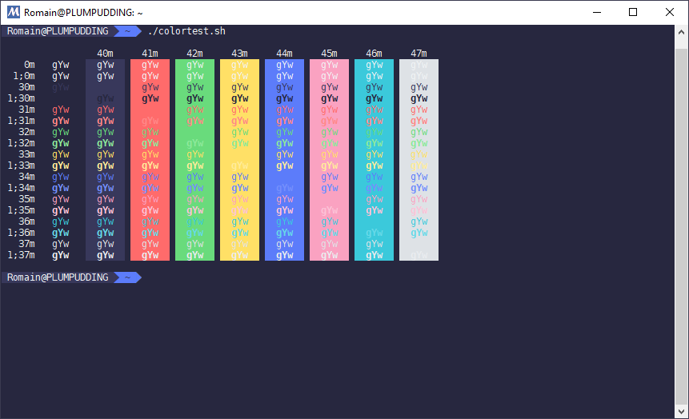

pure-mintty, a color scheme for mintty
======================================

This color theme is inspired by [pure syntax](https://github.com/nkpfstr/pure-syntax), a theme for [Atom](http://atom.io). It uses the colors from the [open color](https://yeun.github.io/open-color/) palette.




Installation
------------

Simply copy the content of [`.pure-mintty`](.pure-mintty) into the `.minttyrc` file in your home directory. You can also copy `.pure-mintty` or clone the repository and execute:

```
cat .pure-mintty >> ~/.minttyrc
```


License
-------

This color scheme is distributed under the [MIT License](LICENSE.md).


Thanks
------

Thanks to @nkpfstr and Open Color for their amazing work.
